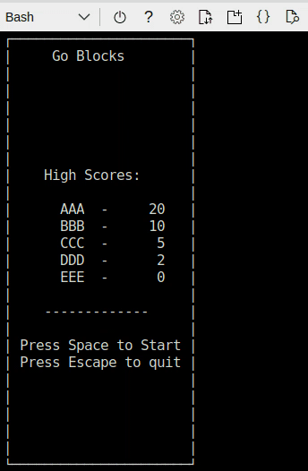
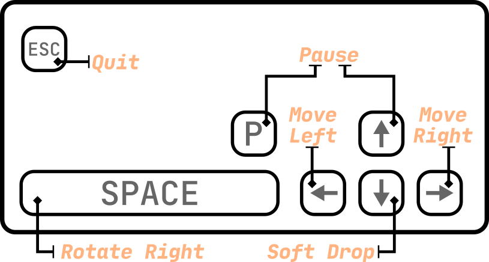

This is a small modification of **GoTermTris** project. Original project is [available here](https://github.com/rDybing/gotermtris). 

Gameplay: 



If you want to play from [Azure Cloud Shell](https://docs.microsoft.com/en-us/azure/cloud-shell/overview) run following code:
```
[ ! -d "go-blocks/.git" ] && git clone https://github.com/groovy-sky/go-blocks
cd go-blocks && git pull
go run gtt.go
```

Keyboard controls:


